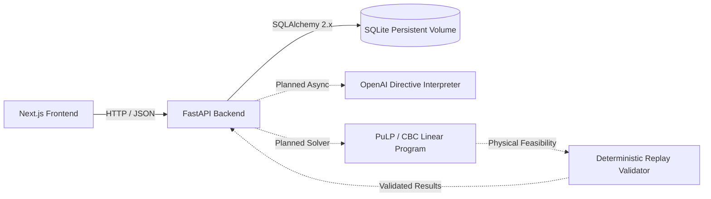

# Smart Campus Energy Optimization Platform

Production-ready scaffold for the **BUP CSE Fest 2026 Smart Campus Energy Optimization Challenge**.

The system accepts 24-hour campus energy telemetry (demand, baseline solar, time-of-use tariffs, and battery parameters) along with natural-language operator directives. It interprets operator directives via an LLM, validates them against deterministic guardrails, optimizes battery charging/discharging and solar/grid dispatch using Linear Programming (PuLP/CBC), replay-validates physical constraints, and surfaces actionable telemetry in a modern web dashboard.

---

## 1. System Architecture



### Future Optimization Pipeline Flow

```text
HTTP POST /api/v1/optimize-energy
       │
       ▼
Optimization Route (FastAPI controller)
       │
       ▼
Optimization Service (Pipeline Coordinator)
       │
       ├─► LLM Interpreter (translates natural language notes into 1 of 6 directive types)
       │
       ├─► Deterministic Guardrails (validates directive bounds against physical battery limits)
       │
       ├─► LP Optimizer (PuLP with CBC solver minimizes total BDT cost subject to physical conservation)
       │
       ├─► Replay Validator (simulates hourly equations to guarantee zero constraint violations)
       │
       ▼
Optimization Repository (Persists Scenario, Notes, and 24-Hour Schedule into SQLite)
       │
       ▼
Strict Pydantic JSON Response
```

> **Note on Scaffold Phase**: For this initial scaffold, the LLM, Guardrail, and Solver components are isolated into modular interface placeholders (`app/services/`). All endpoints return valid, schema-compliant placeholder data while ensuring the full build, migration, test, and containerization toolchains are 100% operational.

---

## 2. Technology Stack

### Frontend
- **Framework**: Next.js 15+ (App Router)
- **Language**: TypeScript (strict mode, zero unconstrained `any`)
- **Styling**: Tailwind CSS v4 & sleek dark-mode glassmorphism design system
- **Components**: shadcn/ui primitives (`Card`, `Button`, `Badge`)
- **Visualizations**: Recharts (`DemandChart`, `SolarChart`, `BatteryChart`)
- **Icons**: Lucide React
- **Client**: Strongly typed `apiClient` abstraction

### Backend
- **Language**: Python 3.13+ / 3.14
- **Web Framework**: FastAPI (modular monolith)
- **Validation**: Pydantic v2 & Pydantic Settings
- **ORM & Migrations**: SQLAlchemy 2.x & Alembic
- **Database**: SQLite (built into Python, zero external database container)
- **Solver Interface**: PuLP (configured for CBC)
- **Code Quality**: Ruff (linter & formatter)
- **Testing**: pytest, pytest-asyncio, HTTPX

### Infrastructure
- **Containerization**: Docker multi-stage builds & Docker Compose
- **Data Persistence**: Bound persistent volume (`./backend/data:/app/data`)
- **Continuous Integration**: GitHub Actions (`.github/workflows/ci.yml`)

---

## 3. Repository Architecture

Monorepo layout:

```text
smart-campus-energy-optimization/
├── frontend/                     # Next.js 15+ App Router application
│   ├── app/                      # Routes (/, /dashboard, /api/health)
│   ├── components/               # UI, layout, energy domain, and charts
│   ├── lib/                      # Typed apiClient, constants, utils
│   ├── types/                    # Energy domain and API TypeScript interfaces
│   ├── Dockerfile                # Multi-stage production container
│   ├── package.json
│   └── tsconfig.json
│
├── backend/                      # FastAPI modular monolith
│   ├── app/
│   │   ├── api/                  # Routers & endpoint controllers (/health, /api/v1/optimize-energy)
│   │   ├── core/                 # Config (Pydantic Settings), logging, exceptions
│   │   ├── db/                   # SQLAlchemy 2.x Base, session, and models
│   │   │   └── models/           # Scenario, OperatorNote, Optimization, ScheduleEntry
│   │   ├── schemas/              # Pydantic v2 schemas
│   │   ├── services/             # OptimizationService, LLMService, ValidationService
│   │   └── repositories/         # OptimizationRepository (SQLite isolation)
│   ├── alembic/                  # Alembic migration environment & versions
│   ├── data/                     # Persistent SQLite database storage (git-ignored)
│   ├── tests/                    # Pytest suite (health, validation, models, Alembic)
│   ├── Dockerfile                # Python 3.13-slim container
│   ├── pyproject.toml            # Ruff & pytest configuration
│   └── requirements.txt
│
├── docs/                         # Architecture documentation & prototype references
│   └── reference/                # Prototype algorithm archives & sample payloads
│
├── scripts/                      # Developer automation scripts (dev.sh, validate_sample.py)
├── .github/workflows/            # GitHub Actions CI workflow (ci.yml)
├── docker-compose.yml            # Frontend and Backend orchestration
├── Makefile                      # Standard developer command automation
├── .env.example                  # Root environment configuration template
├── .gitignore                    # Comprehensive multi-language ignore rules
├── .dockerignore                 # Image build optimization ignore rules
├── LICENSE                       # MIT License
└── README.md                     # Project documentation
```

---

## 4. Why SQLite Was Selected

SQLite was chosen for this hackathon service because:
1. **Zero Operational Overhead**: Eliminates the need for a separate database container (such as PostgreSQL), reducing resource consumption and startup latency.
2. **Deterministic Single-Node Optimization**: Optimization runs are computationally CPU-bound (PuLP/CBC solver) rather than I/O-bound, so high concurrent database write volume is not required.
3. **Simplicity & Portability**: Setup requires zero cloud provisioning or local connection string debugging.
4. **Volume Persistence**: With `./backend/data:/app/data` mapped in Docker Compose, the database persists reliably across container restarts and builds.
5. **Future Migration Ready**: Database interactions are strictly encapsulated behind `OptimizationRepository` and SQLAlchemy 2.x declarative models. Migrating to PostgreSQL in the future requires only changing the `DATABASE_URL` connection string, with zero changes required in routes or services.

---

## 5. Local Setup & Quickstart

### Prerequisites
- Python 3.13 or 3.14
- Node.js 20+ or 22+
- Docker & Docker Compose (optional, for containerized run)
- `make` (optional, for simplified commands)

### Environment Configuration

1. Copy `.env.example` to create root and service environment files:
   ```bash
   cp .env.example backend/.env
   cp frontend/.env.example frontend/.env.local
   ```

2. Configure environment variables in `backend/.env` if using OpenAI features:
   ```env
   OPENAI_API_KEY=your_key_here
   OPENAI_MODEL=gpt-4o-mini
   ```

---

## 6. Running Locally with Makefile

A standard `Makefile` is provided at the root:

| Command | Description |
|---|---|
| `make dev` | Start both FastAPI backend (:8000) and Next.js frontend (:3000) concurrently |
| `make backend` | Start FastAPI backend server with hot-reload |
| `make frontend` | Start Next.js frontend development server |
| `make test` | Run all automated test suites (backend pytest + frontend tsc) |
| `make lint` | Run code quality linters (Ruff on backend + ESLint on frontend) |
| `make format` | Automatically format backend code using Ruff |
| `make migrate` | Apply Alembic database migrations to SQLite |
| `make migration msg="..."` | Generate a new Alembic migration revision |
| `make docker-up` | Build and start services using Docker Compose |
| `make docker-down` | Stop and remove Docker Compose containers |

---

## 7. Running with Docker Compose

Run the entire application stack in containers with one command:

```bash
docker compose up --build
```

- **Frontend UI**: [http://localhost:3000](http://localhost:3000)
- **FastAPI Backend**: [http://localhost:8000](http://localhost:8000)
- **Interactive Swagger Docs**: [http://localhost:8000/docs](http://localhost:8000/docs)
- **Health Checks**:
  - `http://localhost:8000/health`
  - `http://localhost:8000/api/v1/health`

### SQLite Persistence Guarantee

The SQLite database file is persisted to `./backend/data/smart_campus_energy.db` on your host machine. You can verify that data persists across container lifecycles:

```bash
# Restart or recreate containers
docker compose down
docker compose up -d

# Notice that previously saved scenarios and optimization runs remain intact in ./backend/data/
```

---

## 8. API Specification

### `GET /health` & `GET /api/v1/health`
Returns health check confirmation.
```json
{
  "status": "ok"
}
```

### `POST /api/v1/optimize-energy`
Submits 24-hour campus profiles and natural language operator directives.

**Sample Request**:
```json
{
  "demand_kwh": [35, 34, 33, 32, 31, 30, 32, 38, 45, 52, 58, 62, 65, 68, 70, 72, 75, 78, 74, 68, 60, 52, 45, 40],
  "base_solar_kwh": [0, 0, 0, 0, 0, 0, 3, 8, 15, 22, 30, 38, 42, 44, 40, 32, 22, 12, 5, 0, 0, 0, 0, 0],
  "tariff_bdt_per_kwh": [8, 8, 8, 8, 8, 8, 9, 9, 10, 10, 11, 12, 12, 13, 13, 14, 15, 15, 14, 12, 11, 10, 9, 9],
  "battery": {
    "capacity_kwh": 100,
    "initial_energy_kwh": 40,
    "minimum_energy_kwh": 10,
    "max_charge_kwh_per_hour": 25,
    "max_discharge_kwh_per_hour": 25
  },
  "operator_notes": [
    "Reduce solar from 1 PM to 3 PM by 80%",
    "Do not charge the battery from 6 PM to 8 PM"
  ]
}
```

**Scaffold Response**:
```json
{
  "directive_interpretation": [
    {
      "note_index": 0,
      "directive_type": "no_op",
      "structured_adjustment": { "raw_note": "Reduce solar...", "status": "scaffold_placeholder" },
      "applies": true
    }
  ],
  "schedule": [
    {
      "hour": 0,
      "demand_kwh": 35.0,
      "effective_solar_kwh": 0.0,
      "solar_used_kwh": 0.0,
      "battery_charge_kwh": 0.0,
      "battery_discharge_kwh": 0.0,
      "battery_energy_after_kwh": 40.0,
      "grid_kwh": 35.0,
      "tariff_bdt_per_kwh": 8.0,
      "grid_cost_bdt": 280.0
    }
  ],
  "total_grid_cost_bdt": 9850.0,
  "total_grid_kwh": 840.0,
  "verification": {
    "verified": true,
    "max_constraint_error": 0.0,
    "total_grid_cost_bdt": 9850.0
  },
  "status_message": "[SCAFFOLD_PLACEHOLDER] Optimization pipeline scaffold response. Business logic will be implemented in next phase."
}
```

---

## 9. Verification & Quality Assurance

Run the test suite:
```bash
make test
```
Outputs:
- **Pytest**: 8 passed (health routes, invalid payload rejection, battery parameter validation, database models, and Alembic configuration).
- **TypeScript**: 0 type errors across Next.js components, API client, and domain types.
- **Ruff & ESLint**: Clean passes.

---

## 10. License

This project is licensed under the MIT License - see the [LICENSE](LICENSE) file for details.
