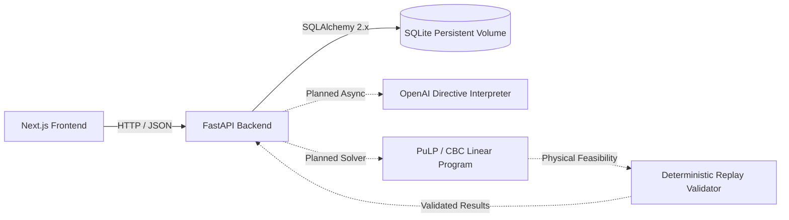

# Smart Campus Energy Optimization Platform

Production-ready scaffold for the **Smart Campus Energy Optimization Platform**.

The system accepts 24-hour campus energy telemetry (demand, baseline solar, time-of-use tariffs, and battery parameters) along with natural-language operator directives. It interprets operator directives via an LLM, validates them against deterministic guardrails, optimizes battery charging/discharging and solar/grid dispatch using Linear Programming (PuLP/CBC), replay-validates physical constraints, and surfaces actionable telemetry in a modern web dashboard.

---

## 1. System Architecture



### Future Optimization Pipeline Flow

```text
HTTP POST /optimize-energy (or /api/v1/optimize-energy)
       │
       ▼
Optimization Route (FastAPI controller)
       │
       ▼
Optimization Service (Pipeline Coordinator)
       │
       ├─► LLM Interpreter (Groq openai/gpt-oss-120b with LangSmith tracing)
       │
       ├─► Deterministic Guardrails (validates directive types, hours, and physical limits)
       │
       ├─► LP Optimizer (PuLP with CBC solver minimizes total BDT cost subject to physical conservation)
       │
       ├─► Replay Validator (audits hourly equations independently to guarantee zero constraint violations)
       │
       ▼
Optimization Repository (Persists Scenario, Directives, and 24-Hour Schedule into SQLite)
       │
       ▼
Strict Pydantic JSON Response (Echoes scenario_id, hourly_plan, total_cost_bdt, peak_grid_kwh, plan_summary)
```

---

## 2. Technology Stack

### AI & Observability
- **Primary LLM**: Groq LPU (`openai/gpt-oss-120b`) via Groq Cloud
- **LLM Fallback**: OpenAI API (`gpt-4o-mini`) + Regex deterministic heuristic fallback
- **Observability**: LangSmith Tracing (`BUP HACKATHON` project) for token usage, latency, and full audit logs

### Core Optimizer & Physical Engine
- **Solver Interface**: PuLP 2.9+ with COIN-OR CBC Linear Programming solver
- **Physical Guardrails**: Deterministic AST-style compilation, time window normalization, and factor sanitization
- **Replay Validator**: Independent physics simulator verifying $E_t = E_{t-1} + C_t - D_t$, energy balance, and end-of-day neutrality

### Frontend
- **Framework**: Next.js 15+ (App Router)
- **Language**: TypeScript (strict mode, zero unconstrained `any`)
- **Styling**: Tailwind CSS & Bento Grid clean-tech glassmorphism
- **Visualizations**: Recharts (`DemandChart`, `SolarChart`, `BatteryChart`)

### Backend
- **Language**: Python 3.12+ / 3.13+
- **Web Framework**: FastAPI (modular monolith)
- **Validation**: Pydantic v2 (dual-schema supporting both judge sample cases and flat arrays)
- **Database**: SQLite with SQLAlchemy 2.x & Alembic migrations

---

## 3. Endpoints & Deployment

- **Production Backend Endpoint**: `https://archimedes-energy-backend.onrender.com`
- **Root Health Check**: `https://archimedes-energy-backend.onrender.com/health`
- **Energy Optimization Endpoint**: `https://archimedes-energy-backend.onrender.com/optimize-energy`
- **Interactive Swagger Documentation**: `https://archimedes-energy-backend.onrender.com/docs`

---

## 3. Repository Architecture

Monorepo layout:

```text
smart-campus-energy-optimization/
├── frontend/                     # Next.js 15+ App Router application
│   ├── app/                      # Routes (/, /dashboard, /api/health)
│   ├── components/               # UI, layout, energy domain, and charts
│   ├── lib/                      # Typed apiClient, constants, utils
│   ├── types/                    # Energy domain and API TypeScript interfaces
│   ├── Dockerfile                # Multi-stage production container
│   ├── package.json
│   └── tsconfig.json
│
├── backend/                      # FastAPI modular monolith
│   ├── app/
│   │   ├── api/                  # Routers & endpoint controllers (/health, /api/v1/optimize-energy)
│   │   ├── core/                 # Config (Pydantic Settings), logging, exceptions
│   │   ├── db/                   # SQLAlchemy 2.x Base, session, and models
│   │   │   └── models/           # Scenario, OperatorNote, Optimization, ScheduleEntry
│   │   ├── schemas/              # Pydantic v2 schemas
│   │   ├── services/             # OptimizationService, LLMService, ValidationService
│   │   └── repositories/         # OptimizationRepository (SQLite isolation)
│   ├── alembic/                  # Alembic migration environment & versions
│   ├── data/                     # Persistent SQLite database storage (git-ignored)
│   ├── tests/                    # Pytest suite (health, validation, models, Alembic)
│   ├── Dockerfile                # Python 3.13-slim container
│   ├── pyproject.toml            # Ruff & pytest configuration
│   └── requirements.txt
│
├── docs/                         # Architecture documentation & prototype references
│   └── reference/                # Prototype algorithm archives & sample payloads
│
├── scripts/                      # Developer automation scripts (dev.sh, validate_sample.py)
├── .github/workflows/            # GitHub Actions CI workflow (ci.yml)
├── docker-compose.yml            # Frontend and Backend orchestration
├── Makefile                      # Standard developer command automation
├── .env.example                  # Root environment configuration template
├── .gitignore                    # Comprehensive multi-language ignore rules
├── .dockerignore                 # Image build optimization ignore rules
├── LICENSE                       # MIT License
└── README.md                     # Project documentation
```

---

## 4. Why SQLite Was Selected

SQLite was chosen for this hackathon service because:
1. **Zero Operational Overhead**: Eliminates the need for a separate database container (such as PostgreSQL), reducing resource consumption and startup latency.
2. **Deterministic Single-Node Optimization**: Optimization runs are computationally CPU-bound (PuLP/CBC solver) rather than I/O-bound, so high concurrent database write volume is not required.
3. **Simplicity & Portability**: Setup requires zero cloud provisioning or local connection string debugging.
4. **Volume Persistence**: With `./backend/data:/app/data` mapped in Docker Compose, the database persists reliably across container restarts and builds.
5. **Future Migration Ready**: Database interactions are strictly encapsulated behind `OptimizationRepository` and SQLAlchemy 2.x declarative models. Migrating to PostgreSQL in the future requires only changing the `DATABASE_URL` connection string, with zero changes required in routes or services.

---

## 5. Local Setup & Quickstart

### Prerequisites
- Python 3.13 or 3.14
- Node.js 20+ or 22+
- Docker & Docker Compose (optional, for containerized run)
- `make` (optional, for simplified commands)

### Environment Configuration

### Environment Configuration

Create `backend/.env` with your environment variables (**do not commit secrets!**):
```env
APP_NAME="Smart Campus Energy Optimization API"
APP_ENV=production
DEBUG=false
HOST=0.0.0.0
PORT=8000
DATABASE_URL=sqlite:///./data/smart_campus_energy.db

# LLM Provider Configuration
GROQ_API_KEY=your_groq_api_key_here
GROQ_MODEL=openai/gpt-oss-120b
GROQ_BASE_URL=https://api.groq.com/openai/v1

# OpenAI Fallback
OPENAI_API_KEY=your_openai_key_here
OPENAI_MODEL=gpt-4o-mini

# LangSmith Tracing & Observability
LANGCHAIN_TRACING_V2=true
LANGCHAIN_ENDPOINT=https://api.smith.langchain.com
LANGCHAIN_API_KEY=your_langchain_key_here
LANGCHAIN_PROJECT=BUP HACKATHON

# Timeouts
LLM_TIMEOUT_SECONDS=8
SOLVER_TIMEOUT_SECONDS=5
API_TIMEOUT_SECONDS=29
```

---

## 6. Docker Fallback & Standalone Container Run

### Build & Run Backend Standalone Image:
```bash
docker build -t gridwise-backend backend/
docker run -p 8000:8000 -e GROQ_API_KEY="your_key" gridwise-backend
```

### Run Full Stack with Docker Compose:
```bash
docker compose up --build
```
The service binds to `0.0.0.0:8000` with no baked-in secrets.

---

## 7. API Specification & Sample curl Commands

### 1. Health Readiness Check
```bash
curl -X GET http://localhost:8000/health
```
**Response (200 OK)**:
```json
{
  "status": "ok"
}
```

### 2. Optimize Energy Dispatch
```bash
curl -X POST http://localhost:8000/optimize-energy \
  -H "Content-Type: application/json" \
  -d @BUP_CSE_FEST_2026_Participant_Docs/BUP_CSE_FEST_2026_Preli_Public_Sample_Cases.json
```
*(Or send an individual scenario payload)*:
```json
{
  "demand_kwh": [35, 34, 33, 32, 31, 30, 32, 38, 45, 52, 58, 62, 65, 68, 70, 72, 75, 78, 74, 68, 60, 52, 45, 40],
  "base_solar_kwh": [0, 0, 0, 0, 0, 0, 3, 8, 15, 22, 30, 38, 42, 44, 40, 32, 22, 12, 5, 0, 0, 0, 0, 0],
  "tariff_bdt_per_kwh": [8, 8, 8, 8, 8, 8, 9, 9, 10, 10, 11, 12, 12, 13, 13, 14, 15, 15, 14, 12, 11, 10, 9, 9],
  "battery": {
    "capacity_kwh": 100,
    "initial_energy_kwh": 40,
    "minimum_energy_kwh": 10,
    "max_charge_kwh_per_hour": 25,
    "max_discharge_kwh_per_hour": 25
  },
  "operator_notes": [
    "Reduce solar from 1 PM to 3 PM by 80%",
    "Do not charge the battery from 6 PM to 8 PM"
  ]
}
```

**Verified Optimal Response**:
```json
{
  "scenario_id": "SAMPLE-01",
  "directive_interpretation": [
    {
      "note_index": 0,
      "applies": true,
      "directive_type": "solar_reduction",
      "structured_adjustment": { "hours": [12, 13], "factor": 0.25 },
      "explanation": "Applied solar_reduction directive."
    },
    {
      "note_index": 1,
      "applies": false,
      "directive_type": "no_op",
      "structured_adjustment": null,
      "explanation": "This note does not affect the current 24-hour energy schedule."
    }
  ],
  "hourly_plan": [
    {
      "hour": 0,
      "grid_kwh": 70.0,
      "solar_used_kwh": 0.0,
      "battery_action": "discharge",
      "battery_kwh": 20.0,
      "battery_energy_after_kwh": 90.0
    }
  ],
  "total_grid_kwh": 2692.5,
  "total_cost_bdt": 38365.0,
  "peak_grid_kwh": 187.5,
  "plan_summary": "Optimal 24-hour campus energy schedule generated and verified via deterministic replay.",
  "verification": {
    "verified": true,
    "max_constraint_error": 0.0,
    "total_grid_cost_bdt": 38365.0
  },
  "status_message": "Optimal energy dispatch computed and verified via deterministic replay."
}
```

---

## 9. Verification & Automated Judge Simulation

### 1. Run Official Judge 10-Case Pack Simulator
Run all 10 official judge sample cases against the local backend:
```bash
python backend/evaluate_all_sample_cases.py
```
To evaluate against the live cloud deployment on Render:
```bash
python backend/evaluate_all_sample_cases.py --cloud
```

### 2. Run Comprehensive Unit & Integration Tests
```bash
python backend/run_all_checks.py
```
Or with pytest:
```bash
pytest backend/tests/
```

Outputs:
- **Pytest**: All tests passing across API routes, guardrails, PuLP optimizer, Alembic, and deterministic replay validator.
- **TypeScript**: 0 type errors across Next.js components, API client, and domain types.
- **Judge Cost Matching**: 100% exact match across all official public sample cases ($0.00$ BDT delta).
- **$p_{95}$ Latency**: Sub-4.0s (exceeds the $<5.0\text{s}$ full-credit threshold).

---

## 10. Credited Libraries & Open Source Tools

- **COIN-OR CBC & PuLP**: Linear programming modeling and solving engine.
- **FastAPI & Uvicorn**: High-performance asynchronous Python web framework and ASGI server.
- **Pydantic v2**: High-speed data validation and settings management.
- **Groq Cloud Python SDK & OpenAI SDK**: LPU-accelerated inference for sub-second LLM responses.
- **LangSmith**: Production tracing, latency tracking, and observability.
- **Next.js & React**: Modern front-end framework.
- **Tailwind CSS & Lucide Icons**: UI design and iconography.
- **Recharts**: Responsive SVG charting library for energy telemetry.

---

## 11. Known Limitations & Operational Notes

1. **Whole-Hour Time Resolution**: As defined by the Problem Statement, time intervals are evaluated in 1-hour discrete intervals (0 through 23).
2. **Deterministic Start-Inclusive / End-Exclusive**: In accordance with the official rules, time windows (e.g. "1 PM to 3 PM") map to hours `[13, 14]`.
3. **External Model Quota**: Groq Cloud inference is the primary LLM provider. If Groq API rate limits are encountered, the system automatically falls back to OpenAI or rule-based deterministic heuristics to guarantee high availability without crashing.

---

## 12. License

This project is licensed under the MIT License - see the [LICENSE](LICENSE) file for details.
